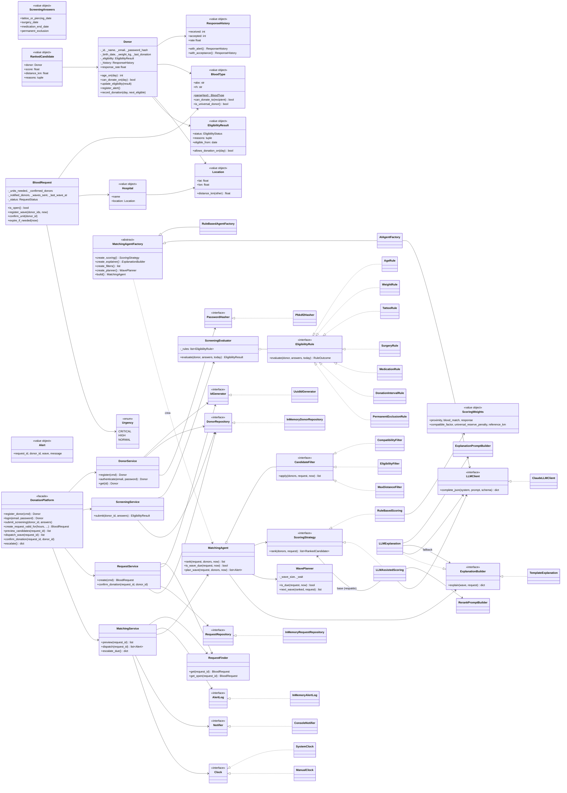

# Diagrama de clases – MVP

GitHub dibuja este diagrama automáticamente (Mermaid).

```mermaid
classDiagram
    direction LR

    %% ================= DOMINIO =================
    class BloodType {
        <<value object>>
        +abo: str
        +rh: str
        +parse(text)$ BloodType
        +can_donate_to(recipient) bool
        +is_universal_donor() bool
    }
    class Location {
        <<value object>>
        +lat: float
        +lon: float
        +distance_km(other) float
    }
    class EligibilityResult {
        <<value object>>
        +status: EligibilityStatus
        +reasons: tuple
        +eligible_from: date
        +allows_donation_on(day) bool
    }
    class ScreeningAnswers {
        <<value object>>
        +tattoo_or_piercing_date
        +surgery_date
        +medication_end_date
        +permanent_exclusion
    }
    class Donor {
        -_id, _name, _email, _password_hash
        -_birth_date, _weight_kg, _last_donation
        -_eligibility: EligibilityResult
        -_history: ResponseHistory
        +age_on(day) int
        +response_rate float
        +can_donate_on(day) bool
        +update_eligibility(result)
        +register_alert()
        +record_donation(day, next_eligible)
    }
    class ResponseHistory {
        <<value object>>
        +received: int
        +accepted: int
        +rate float
        +with_alert() ResponseHistory
        +with_acceptance() ResponseHistory
    }
    Donor --> ResponseHistory

    class BloodRequest {
        -_units_needed, _confirmed_donors
        -_notified_donors, _waves_sent, _last_wave_at
        -_status: RequestStatus
        +is_open() bool
        +register_wave(donor_ids, now)
        +confirm_unit(donor_id)
        +expire_if_needed(now)
    }
    class Hospital {
        <<value object>>
        +name
        +location: Location
    }
    class Urgency {
        <<enum>>
        CRITICAL
        HIGH
        NORMAL
    }
    class RankedCandidate {
        <<value object>>
        +donor: Donor
        +score: float
        +distance_km: float
        +reasons: tuple
    }
    class Alert {
        <<value object>>
        +request_id, donor_id, wave, message
    }
    Donor --> BloodType
    Donor --> Location
    Donor --> EligibilityResult
    BloodRequest --> BloodType
    BloodRequest --> Hospital
    BloodRequest --> Urgency
    Hospital --> Location
    RankedCandidate --> Donor

    %% ================= TAMIZAJE =================
    class EligibilityRule {
        <<interface>>
        +evaluate(donor, answers, today) RuleOutcome
    }
    class ScreeningEvaluator {
        -_rules: list~EligibilityRule~
        +evaluate(donor, answers, today) EligibilityResult
    }
    EligibilityRule <|.. AgeRule
    EligibilityRule <|.. WeightRule
    EligibilityRule <|.. TattooRule
    EligibilityRule <|.. SurgeryRule
    EligibilityRule <|.. MedicationRule
    EligibilityRule <|.. DonationIntervalRule
    EligibilityRule <|.. PermanentExclusionRule
    ScreeningEvaluator o-- EligibilityRule

    %% ================= AGENTE =================
    class CandidateFilter {
        <<interface>>
        +apply(donors, request, now) list
    }
    CandidateFilter <|.. CompatibilityFilter
    CandidateFilter <|.. EligibilityFilter
    CandidateFilter <|.. MaxDistanceFilter

    class ScoringStrategy {
        <<interface>>
        +rank(donors, request) list~RankedCandidate~
    }
    class ScoringWeights {
        <<value object>>
        +proximity, blood_match, response
        +compatible_factor, universal_reserve_penalty, reference_km
    }
    RuleBasedScoring --> ScoringWeights
    LLMAssistedScoring --> RerankPromptBuilder
    LLMExplanation --> ExplanationPromptBuilder
    ScoringStrategy <|.. RuleBasedScoring
    ScoringStrategy <|.. LLMAssistedScoring
    LLMAssistedScoring --> ScoringStrategy : base (respaldo)
    LLMAssistedScoring --> LLMClient

    class ExplanationBuilder {
        <<interface>>
        +explain(wave, request) dict
    }
    ExplanationBuilder <|.. TemplateExplanation
    ExplanationBuilder <|.. LLMExplanation
    LLMExplanation --> ExplanationBuilder : fallback
    LLMExplanation --> LLMClient

    class WavePlanner {
        -_wave_size, _wait
        +is_due(request, now) bool
        +next_wave(ranked, request) list
    }
    class MatchingAgent {
        +rank(request, donors, now) list
        +is_wave_due(request, now) bool
        +plan_wave(request, donors, now) list~Alert~
    }
    class MatchingAgentFactory {
        <<abstract>>
        +create_scoring()* ScoringStrategy
        +create_explainer()* ExplanationBuilder
        +create_filters() list
        +create_planner() WavePlanner
        +build() MatchingAgent
    }
    MatchingAgentFactory <|-- RuleBasedAgentFactory
    MatchingAgentFactory <|-- AIAgentFactory
    MatchingAgentFactory ..> MatchingAgent : crea
    AIAgentFactory --> LLMClient

    MatchingAgent o-- CandidateFilter
    MatchingAgent --> ScoringStrategy
    MatchingAgent --> WavePlanner
    MatchingAgent --> ExplanationBuilder

    %% ================= PUERTOS Y ADAPTADORES =================
    class DonorRepository { <<interface>> }
    class RequestRepository { <<interface>> }
    class Notifier { <<interface>> }
    class AlertLog { <<interface>> }
    class IdGenerator { <<interface>> }
    class LLMClient {
        <<interface>>
        +complete_json(system, prompt, schema) dict
    }
    class PasswordHasher { <<interface>> }
    class Clock { <<interface>> }
    DonorRepository <|.. InMemoryDonorRepository
    RequestRepository <|.. InMemoryRequestRepository
    Notifier <|.. ConsoleNotifier
    AlertLog <|.. InMemoryAlertLog
    IdGenerator <|.. UuidIdGenerator
    LLMClient <|.. ClaudeLLMClient
    PasswordHasher <|.. Pbkdf2Hasher
    Clock <|.. SystemClock
    Clock <|.. ManualClock

    %% ================= SERVICIOS =================
    class DonationPlatform {
        <<facade>>
        +register_donor(cmd) Donor
        +login(email, password) Donor
        +submit_screening(donor_id, answers)
        +create_request_valid_for(hours, ...) BloodRequest
        +preview_candidates(request_id) list
        +dispatch_wave(request_id) list
        +confirm_donation(request_id, donor_id)
        +escalate() dict
    }
    DonationPlatform --> DonorService
    DonationPlatform --> ScreeningService
    DonationPlatform --> RequestService
    DonationPlatform --> MatchingService
    class RequestFinder {
        +get(request_id) BloodRequest
        +get_open(request_id) BloodRequest
    }
    RequestService --> RequestFinder
    MatchingService --> RequestFinder
    MatchingService --> AlertLog
    DonorService --> IdGenerator
    RequestService --> IdGenerator

    class DonorService {
        +register(cmd) Donor
        +authenticate(email, password) Donor
        +get(id) Donor
    }
    class ScreeningService {
        +submit(donor_id, answers) EligibilityResult
    }
    class RequestService {
        +create(cmd) BloodRequest
        +confirm_donation(request_id, donor_id)
    }
    class MatchingService {
        +preview(request_id) list
        +dispatch(request_id) list~Alert~
        +escalate_due() dict
    }
    DonorService --> DonorRepository
    DonorService --> PasswordHasher
    ScreeningService --> ScreeningEvaluator
    ScreeningService --> DonorRepository
    RequestService --> RequestRepository
    RequestService --> DonorRepository
    MatchingService --> MatchingAgent
    MatchingService --> Notifier
    MatchingService --> Clock
```
